# Testing different functions on Genetic Optimizer and Grey Wolf Optimizer

-----

## Table of Contents

- [Harmonic function](#Harmonic-function)
- [Parametric function](#Parametric-function)
- [Easom function](#Easom-function)
- [Ackley function](#Ackley-function)
- [Cross-in-tray function](#Cross-in-tray-function)
- [Eggholder function](#Eggholder-function)
- [Holder functiion](#Holder-function)
- [Schaffer-1 fucntion](#Schaffer-1-fucntion)
- [Schaffer-2 fucntion](#Schaffer-2-fucntion)  

-----

### Harmonic function

$$
f(x) = x^3(3-x)^5\sin(10\pi x), x\in[0,3]
$$

**Expected minimum**: $$f(1.15)=-33$$

> Genetic Optimizer plot on each epoch:

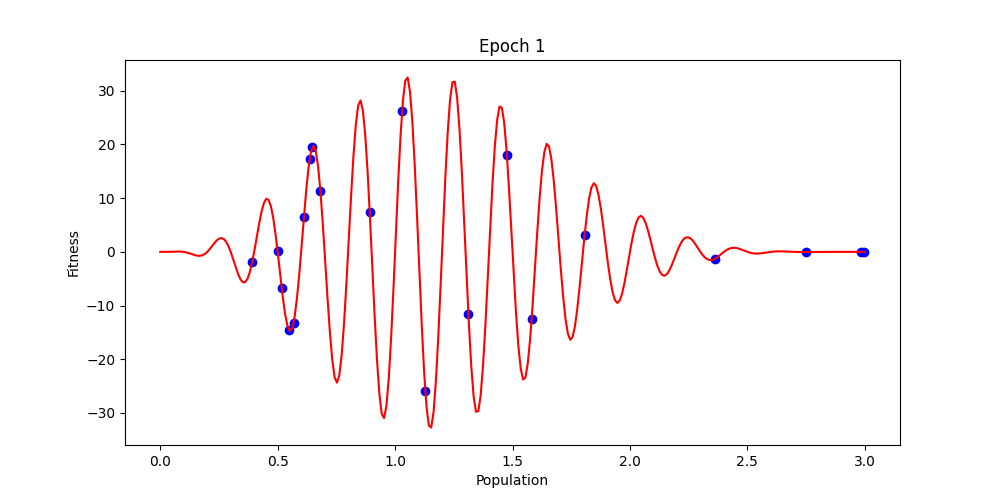 

> Grey Wolf Optimizer plot on each epoch:

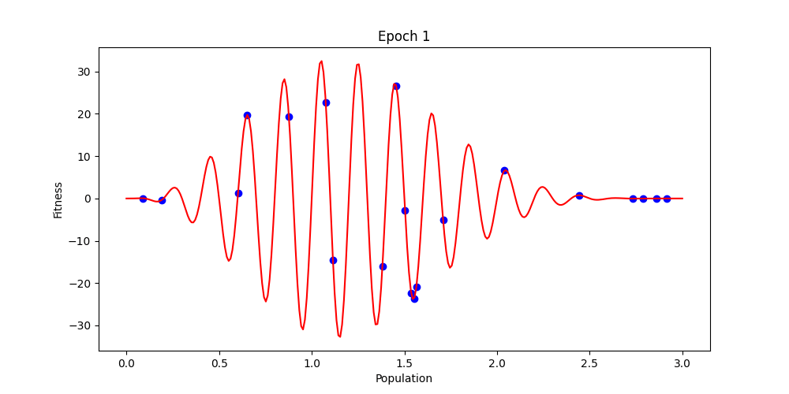

> Genetic Optimizer fitness trend plot:

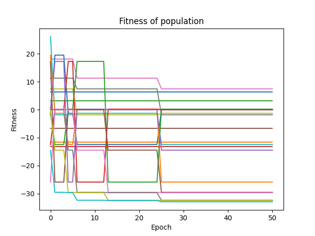

> Grey Wolf Optimizer fitness trend plot:

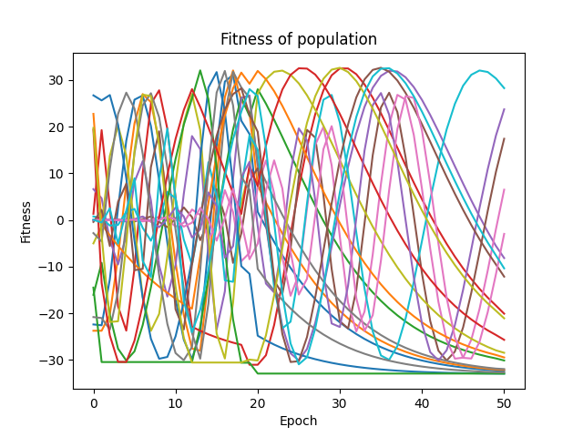

> Genetic Optimizer distance between optimal values on each plot:

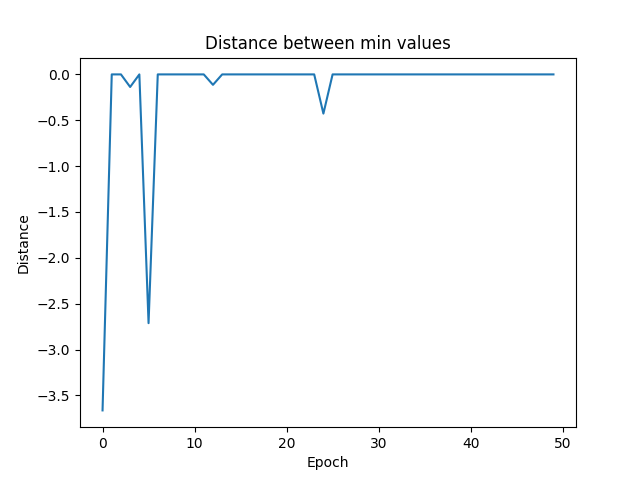

> Grey Wolf Optimizer distance between optimal values on each plot:

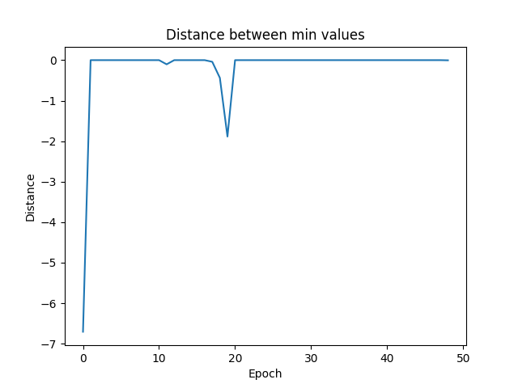

-----

### Parametric function

$$
f(x) = -(0.2-x)^5(0.8-x)^12\sin(12\pi x)\sin(9\pi x), x\in[0,3]
$$

**Expected minimum**: $$f(3)=1.5\cdot 10^(-6)$$

> Genetic Optimizer plot on each epoch:

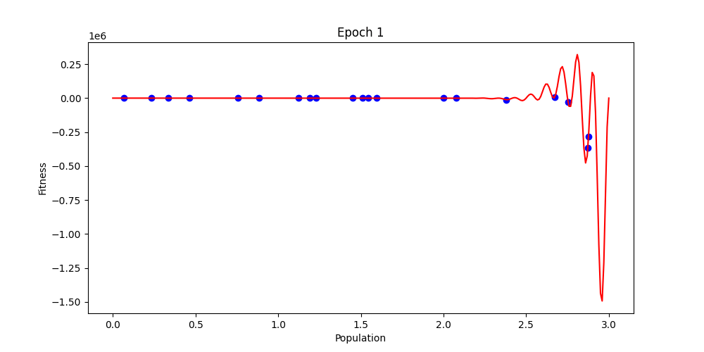 

> Grey Wolf Optimizer plot on each epoch:

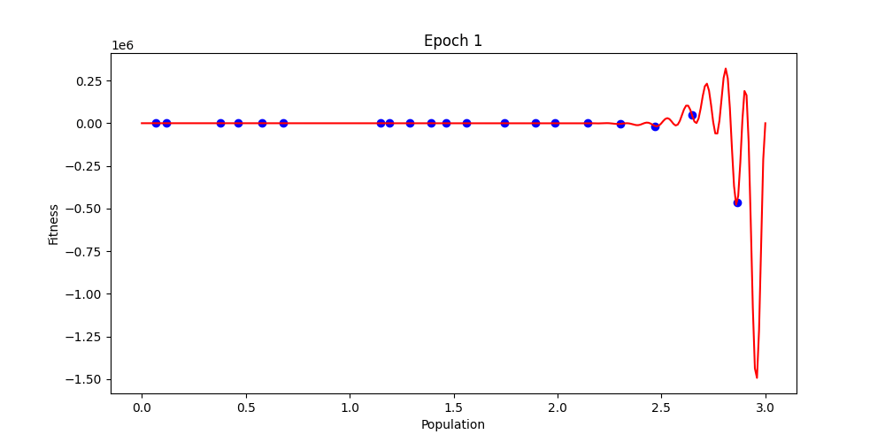

> Genetic Optimizer fitness trend plot:

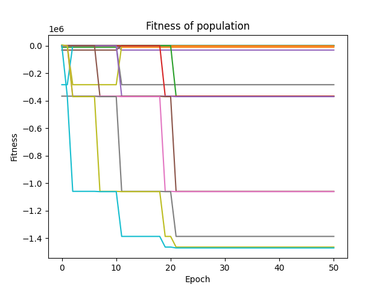

> Grey Wolf Optimizer fitness trend plot:

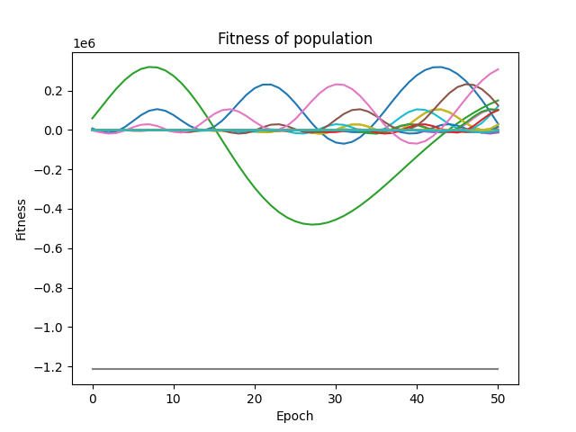

> Genetic Optimizer distance between optimal values on each plot:

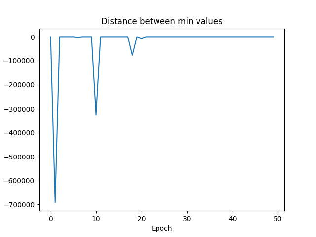

> Grey Wolf Optimizer distance between optimal values on each plot:

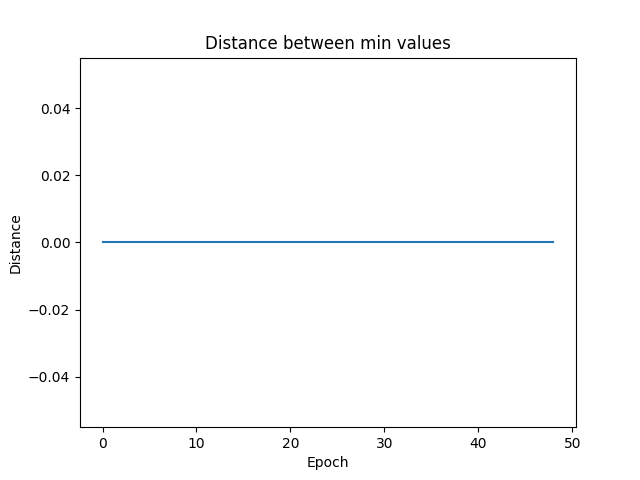
