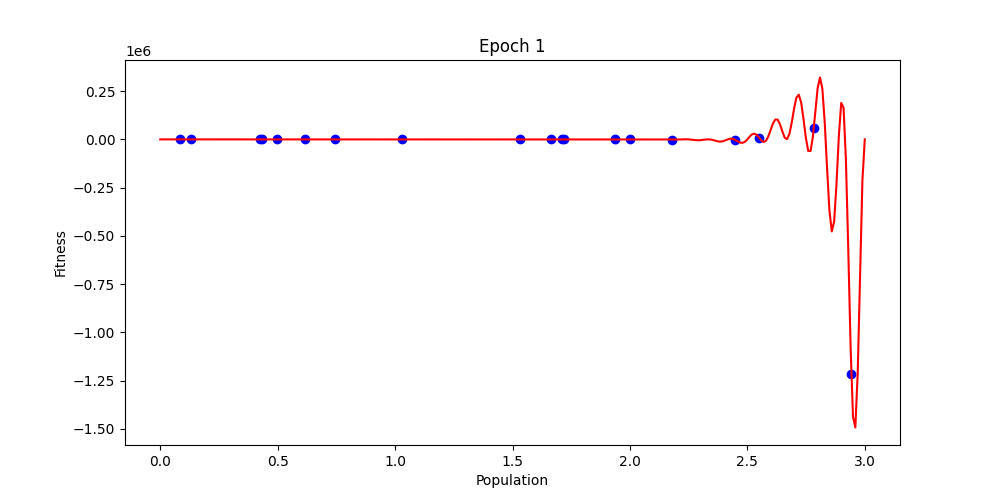
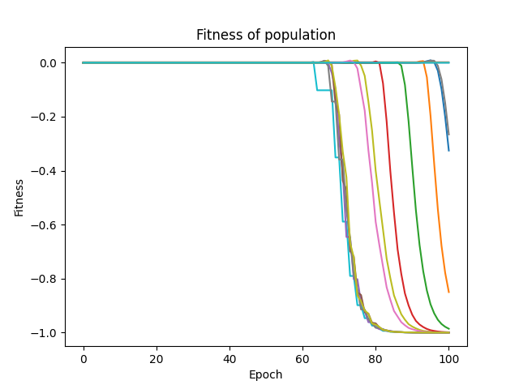
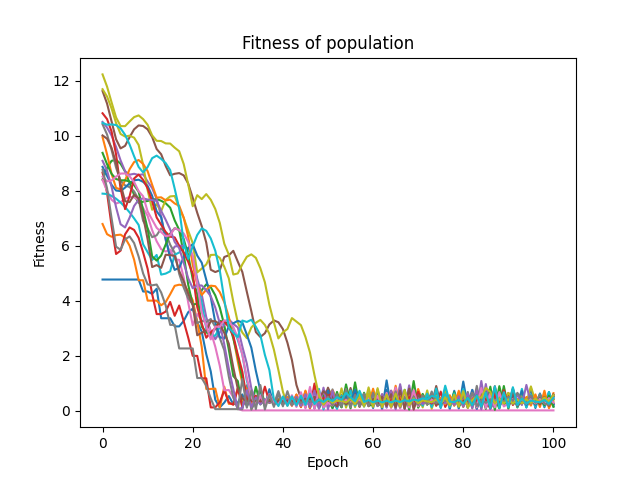
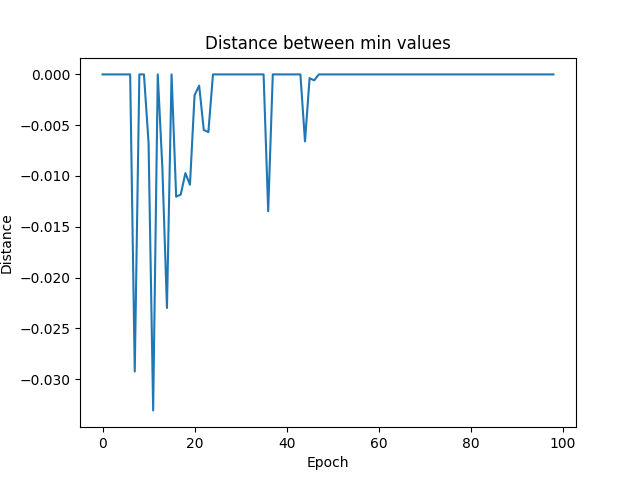
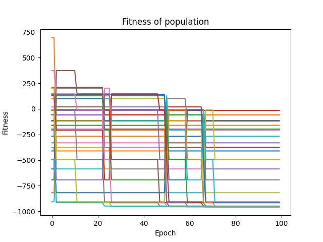
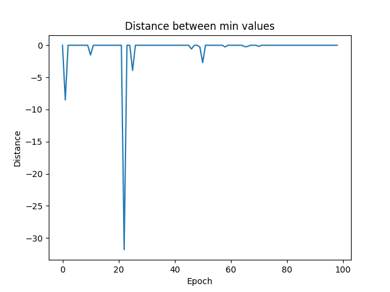
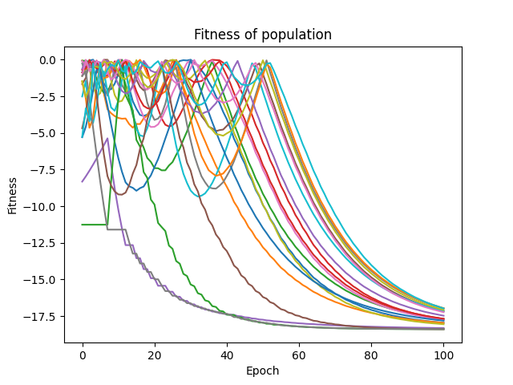
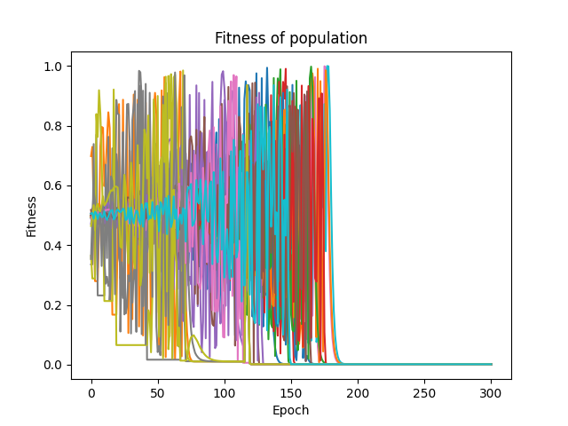

# Testing different functions on Genetic Optimizer and Grey Wolf Optimizer

-----

## Table of Contents

- [Results](#Results)
- [Harmonic function](#Harmonic-function)
- [Parametric function](#Parametric-function)
- [Easom function](#Easom-function)
- [Ackley function](#Ackley-function)
- [Cross-in-tray function](#Cross-in-tray-function)
- [Eggholder function](#Eggholder-function)
- [Holder functiion](#Holder-function)
- [Schaffer-1 fucntion](#Schaffer-1-fucntion)
- [Schaffer-2 fucntion](#Schaffer-2-fucntion)  

-----

### Results
Function | Expected values | Genetic Optimizer | Grey Wolf Optimizer |
:--------:|:----------------:|:-----------------:|:--------------------:
Harmonic| $f(1.15)=-33$ | $f(1.1494621194781416)=-32.95428405521445$ | $f(1.1481284131779566)=-32.905961859252166$
Parametric | $f(3)=-1.5\cdot 10^{6}$ | $f(2.951476310368505)=-1470115.6891036548$ | $f(2.9429072810679084)=-1215321.2790694132$
Easom | $f(\pi,\pi)=-1$ | $f(3.1418326085298105, 3.0807965209429966)=-0.9944698672133057$ | $f(3.1395911675460466, 3.140611097350756)=-0.9999925459278166$
Ackley | $f(0,0)=0$ | $f(-7.629510948348184e-05, 0.014267185473411104)=0.04576559559364668$ | $f(-0.0018062483964494495, 0.0017120980190734464)=0.0072041363161936545$
Cross-in-tray | $f(\pm1.34941,\pm1.34941)=-2.06261, f(\pm1.34941,\mp1.34941)=-2.06261$ | $f(1.3401998931868455, 1.3487449454489955)=-2.0626019956335515$ | $f(1.2822159508185103, -1.3073135638047486)=-2.061918530458744)$
Eggholder | $f(512,404.2319)=−959.6407$ | $f(482.5620508125429, 433.13942168307017)=-956.8413773559901$ | $f(-463.7492364771063, 383.5090460182985=-893.0455018391899$
Holder | $f(\pm8.05502,\pm9.66459)=−19.2085,f(\pm8.05502,\mp9.66459)=−19.2085$ | $f(8.127718013275349, -9.690547035934996)=-19.148642794506788$ | $f(8.105384199924176, 9.377026586887771)=-18.3979642045891$
Schaffer-1 | $f(0,0)=0$ | $f([0.10528725108720494, -0.10528725108720494)=2.217007318755515e-05$ | $f(-1.5012513145301618, -1.5013506330865882)=0.004477599025718315$
Schaffer-2 | $f(0,0.25313)=0.292579$ | $f(0.21515220874341878, 1.2710765239948074)=0.0016598913666932003$ | $f(0.25481509741593006, -1.2787603023170622)=0.0016960809489836581$
Rastrigin | $f(0,0)=0$ | $f(0.005390707255664928, 7.812619211122751e-05)=0.005765882018769375$ | $f(0.0047545949724107145, 0.00034775283313163985)=0.004508546026645632$

//Maybe I'll run more tests with different parameters
_____

### Harmonic function

$$
f(x) = x^3(3-x)^5\sin(10\pi x), x\in[0,3]
$$

**Expected global minimum**: $$f(1.15)=-33$$

> Genetic Optimizer plot on each epoch:

 

> Grey Wolf Optimizer plot on each epoch:

> Genetic Optimizer fitness trend plot:

> Grey Wolf Optimizer fitness trend plot:

> Genetic Optimizer distance between optimal values on each plot:

> Grey Wolf Optimizer distance between optimal values on each plot:

-----

### Parametric function

$$
f(x) = -(0.2-x)^5(0.8-x)^12\sin(12\pi x)\sin(9\pi x), x\in[0,3]
$$

**Expected global minimum**: $$f(3)=1.5\cdot 10^{-6}$$

> Genetic Optimizer plot on each epoch:

 

> Grey Wolf Optimizer plot on each epoch:

> Genetic Optimizer fitness trend plot:

> Grey Wolf Optimizer fitness trend plot:

> Genetic Optimizer distance between optimal values on each plot:

> Grey Wolf Optimizer distance between optimal values on each plot:

### Easom function

$$
f(x, y) = -\cos(x)\cos(y)e^{-(x-\pi)^2-(y-\pi)^2}, (x,y)\in\[-100,100\]^2
$$

**Expected global minimum**: $$f(\pi,\pi)=-1$$

> Genetic Optimizer plot on each epoch:

 

> Grey Wolf Optimizer plot on each epoch:

> Genetic Optimizer fitness trend plot:

> Grey Wolf Optimizer fitness trend plot:

> Genetic Optimizer distance between optimal values on each plot:

> Grey Wolf Optimizer distance between optimal values on each plot:

### Ackley function

$$
f(x, y) = -20e^{-0.2\sqrt{0.5(x^2+y^2)}} - e^{0.5(\cos2\pi x+\cos2\pi y)}, (x,y)\in\[-5,5\]^2
$$

**Expected global minimum**: $$f(0,0)=0$$

> Genetic Optimizer plot on each epoch:

 

> Grey Wolf Optimizer plot on each epoch:

> Genetic Optimizer fitness trend plot:

> Grey Wolf Optimizer fitness trend plot:

> Genetic Optimizer distance between optimal values on each plot:

> Grey Wolf Optimizer distance between optimal values on each plot:

### Cross-in-tray function

$$
f(x, y) = -0.0001\left(\eft|\sin x\sin y e^{\left|100-\frac{\sqrt{x^2+y^2}}{\pi}\right|}\right|+1\right)0.1, (x,y)\in\[-10,10\]^2
$$

**Expected global minimum**: $$f(1.34941,1.34941)=−2.06261, f(1.34941,-1.34941)=−2.06261, f(-1.34941,1.34941)=−2.06261, f(-1.34941,-1.34941)=−2.06261$$

> Genetic Optimizer plot on each epoch:

 

> Grey Wolf Optimizer plot on each epoch:

> Genetic Optimizer fitness trend plot:

> Grey Wolf Optimizer fitness trend plot:

> Genetic Optimizer distance between optimal values on each plot:

> Grey Wolf Optimizer distance between optimal values on each plot:

### Eggholder function

$$
f(x, y) = -(y+47)\sin\sqrt{\left|\frac{x}{2}+y+47\right|}-x\sin\sqrt{|x-y-47|}, (x,y)\in\[-512,512\]^2
$$

**Expected global minimum**: $$f(512,404.2319)=−959.6407$$

> Genetic Optimizer plot on each epoch:

 

> Grey Wolf Optimizer plot on each epoch:

> Genetic Optimizer fitness trend plot:

> Grey Wolf Optimizer fitness trend plot:

> Genetic Optimizer distance between optimal values on each plot:

> Grey Wolf Optimizer distance between optimal values on each plot:

### Holder function

$$
f(x, y) = -\left|\sin x\cos y e^{\left|1-\frac{\sqrt{x^2+y^2}}{\pi}\right|}\right|, (x,y)\in\[-10,10\]^2
$$

**Expected global minimum**: $$f(8.05502,9.66459)=−19.2085, f(8.05502,-9.66459)=−19.2085, f(-8.05502,9.66459)=−19.2085, f(-8.05502,-9.66459)=−19.2085$$

> Genetic Optimizer plot on each epoch:

 

> Grey Wolf Optimizer plot on each epoch:

> Genetic Optimizer fitness trend plot:

> Grey Wolf Optimizer fitness trend plot:

> Genetic Optimizer distance between optimal values on each plot:

> Grey Wolf Optimizer distance between optimal values on each plot:

### Schaffer-1 function

$$
f(x, y) = \frac{1}{2}+\frac{\sin^2(x^2+y^2)-\frac{1}{2}}{(1+0.001(x^2+y^2))^2}, (x,y)\in\[-10,10\]^2
$$

**Expected global minimum**: $$f(0,0)=0$$

> Genetic Optimizer plot on each epoch:

 

> Grey Wolf Optimizer plot on each epoch:

> Genetic Optimizer fitness trend plot:

> Grey Wolf Optimizer fitness trend plot:

> Genetic Optimizer distance between optimal values on each plot:

> Grey Wolf Optimizer distance between optimal values on each plot:

### Schaffer-2 function

$$
f(x, y) = \frac{1}{2}+\frac{\cos(\sin^2|x^2-y^2|)-\frac{1}{2}}{(1+0.001(x^2+y^2))^2}, (x,y)\in\[-100,100\]^2
$$

**Expected global minimum**: $$f(0,0.25313)=0.292579$$

> Genetic Optimizer plot on each epoch:

 

> Grey Wolf Optimizer plot on each epoch:

> Genetic Optimizer fitness trend plot:

> Grey Wolf Optimizer fitness trend plot:

> Genetic Optimizer distance between optimal values on each plot:

> Grey Wolf Optimizer distance between optimal values on each plot:

### Rastrigin function

$$
f(x1, x2) = 20+\sum\limits_{i=1}^n(x_i^2-10\cos(2\pi x_i)), (x,y)\in\[-5,5\]^2
$$

**Expected global minimum**: $$f(0,0)=0$$

> Genetic Optimizer plot on each epoch:

 

> Grey Wolf Optimizer plot on each epoch:

> Genetic Optimizer fitness trend plot:

> Grey Wolf Optimizer fitness trend plot:

> Genetic Optimizer distance between optimal values on each plot:

> Grey Wolf Optimizer distance between optimal values on each plot:

